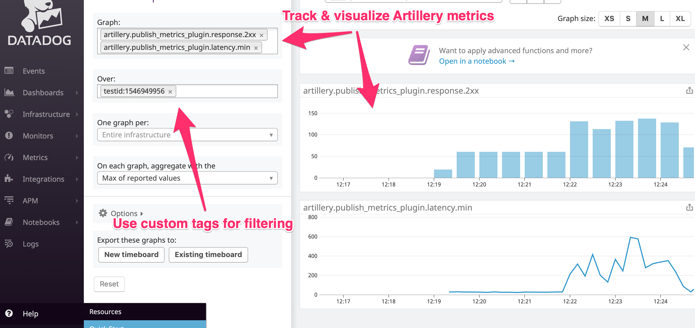

# artillery-plugin-publish-metrics

[](https://circleci.com/gh/artilleryio/artillery-plugin-publish-metrics)

## Purpose

Use this plugin to send metrics tracked by Artillery (e.g. response latency, network errors, HTTP response codes) to an external monitoring/observability system.

**Supported targets:**

- Datadog :dog: (via [agent](https://docs.datadoghq.com/agent/) or [HTTP API](https://docs.datadoghq.com/api/))
- [Honeycomb](https://honeycomb.io) :bee:
- InfluxDB with [Telegraf + StatsD plugin](https://github.com/influxdata/telegraf/tree/master/plugins/inputs/statsd)
- StatsD


## Install

The plugin needs to be installed in the same scope (globally or as a project-specific dependency) as Artillery.

If you installed Artillery globally (i.e. with `npm install -g artillery`) then the plugin needs to be installed globally too:

```sh
npm install -g artillery-plugin-publish-metrics
```

If `artillery` is installed as a project-specific dependency (i.e. in a directory with `package.json` in it), install it with:
t
```sh
npm install artillery-plugin-publish-metrics
```

----
|  |
|:--:|
| *Track, graph and visualize Artillery metrics alongside metrics from your applications and infrastructure* |

## Published metrics

- Virtual user metrics: `scenarios.created`, `scenarios.completed` - number of sessions created and successfully completed
- HTTP-specific metrics:
  - `requests.completed` -- number of requests completed successfully
  - `latency.min / max / median / p95 / p99` -- response time latency distribution
  - `codes.2xx / 3xx / 4xx / 5xx` -- response code counts
  - `rps.mean` -- mean per/second rate of successful responses
- Errors:
  - `error_count` - total number of errors encountered (useful for setting alerts that don't enumerating specific error codes)
  - `errors.ETIMEOUT / ENOTFOUND / EMFILE` - count of specific error codes

## Usage

An example configuration to publish metrics to Datadog via its HTTP API:

```yaml
config:
  plugins:
    publish-metrics:
      - type: datadog
        apiKey: "{{ $processEnvironment.DD_API_KEY }}"
        prefix: artillery.
        tags:
          - team:sre
          - component:eu-payments-backend
          - region:eu-west-1
        event:
          tags:
            - team:sre
```

### Datadog Configuration

The plugin supports sending metrics to an already running Datadog [agent](https://docs.datadoghq.com/agent/) or directly to [Datadog API](https://docs.datadoghq.com/api/). If Datadog agents have already been set up on your infrastructure, then publishing via the agent is probably preferable. Publishing via the HTTP API is useful when running in environments which do not have the agent (e.g. when running Artillery on AWS Lambda or AWS Fargate).

- To send metrics to Datadog, set `type` to `datadog`
- Set `apiKey` to an API key to send metrics directly to Datadog via its HTTP API, or:
- If `apiKey` is not set, metrics will be sent to a Datadog agent:
  - Set `host` to the hostname/IP of the agent (defaults to `127.0.0.1`)
  - Set `port` to the port that the agent is listening on (defaults to `8125`)
- `prefix` -- use a prefix for metric names created by Artillery; defaults to `artillery.`
- `tags` -- a list of `name:value` strings to use as tags for all metrics sent during a test
- `event` -- send a Datadog event when the test starts/finishes
  - `title` -- set to customize the event title; defaults to `Artillery.io Test` + timestamp
  - `text` -- set to customize the event text
  - `priority` -- `normal` or `low`; defaults to `low`
  - `tags` -- a list of event specific tags in the `value:name` format
  - `alertType` -- `error`, `warning`, `info` or `success`; defaults to `info`
  - `send` -- set to `false` to turn off the event. By default, if an `event` is configured, it will be sent. This option makes it possible to turn event creation on/off on the fly (e.g. via an environment variable)

### Honeycomb Configuration

- To send events to Honeycomb, set `type` to `honeycomb`
- Set `apiKey` to API/write key
- Set `dataset` to the name of a dataset you want to send events to
- Optional: set `enabled` to `false` to disable the integration
- Optional: set `sampleRate` to sample rate (default: `1` i.e. send all events) ([Honeycomb docs](https://doc.esdoc.org/github.com/honeycombio/libhoney-js/class/src/libhoney.js~Libhoney.html#instance-set-sampleRate))

Honeycomb integration sends an event for every HTTP response (rather than pre-aggregated metrics).

The following properties are set on every event:

- `url` - full URL of the request
- `host` - hostname + port
- `method` - HTTP method, e.g. `GET`
- `statusCode` - status code, e.g. `200`
- `responseTimeMs` - time-to-first-byte of the response in milliseconds

#### Example configuration

```
config:
  plugins:
    publish-metrics:
      - type: honeycomb
        apiKey: "{{ $processEnvironment.HONEYCOMB_API_KEY" }}
        dataset: load-testing
```

### StatsD Configuration

- To send metrics to StatsD, set `type` to `statsd`
- Set `host` and `port` to hostname/IP and port of the agent (if different from the default `127.0.0.1:8125`)
- Set `prefix` to use a custom prefix for metric names created by Artillery; defaults to `artillery.`

### InfluxDB/Telegraf Configuration

- To send metrics to Telegraf (with Telegraf's [statsd Service Plugin](https://github.com/influxdata/telegraf/tree/master/plugins/inputs/statsd)), set `type` to `influxdb-statsd`
- All other options are the same as for Datadog (other than `apiKey` which is not relevant).

## License

MPL 2.0

## Bugs & Feature Suggestions

Please create an [issue](https://github.com/artilleryio/artillery/issues) to report a bug or suggest an improvement.

**To be implemented:**

- InfluxDB (HTTP API)
- Splunk
- Prometheus
- ELK
- CloudWatch

(Want to help add your favorite monitoring system? Drop us a line.)
